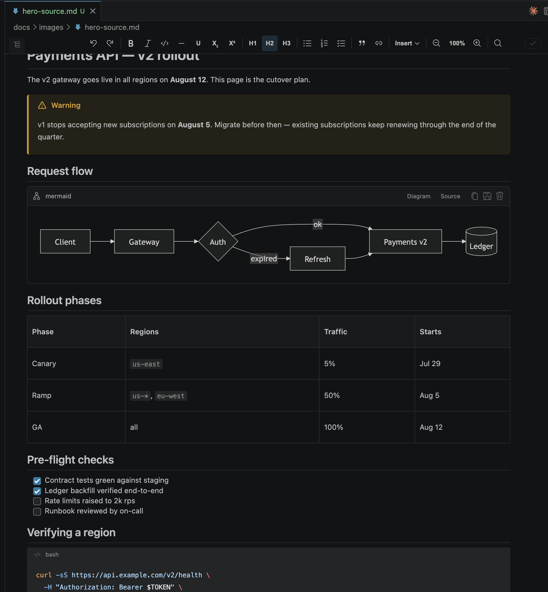
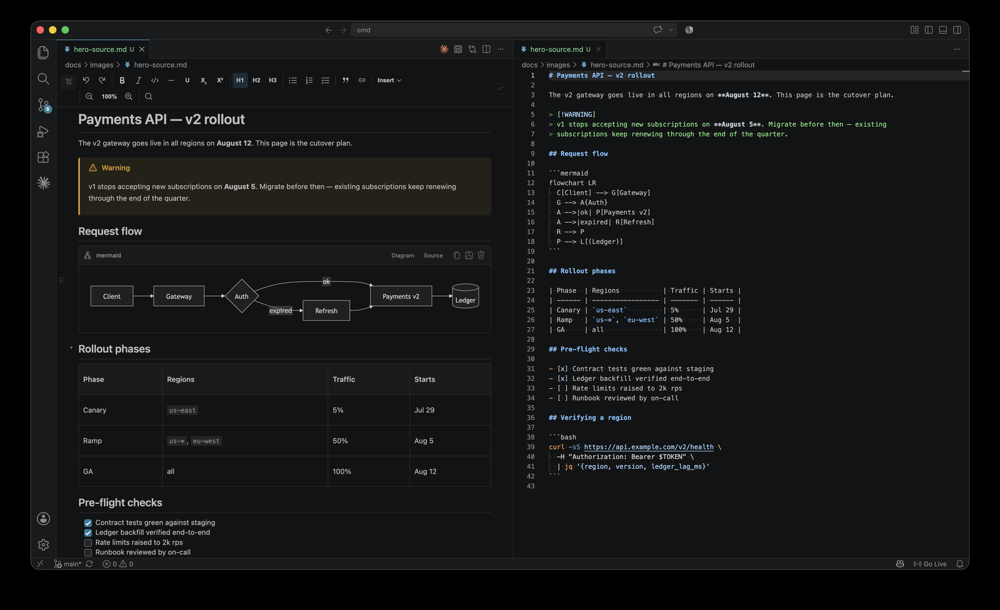

# OMD — Edit documents, not markup

**A WYSIWYG editor for `.md` files that never takes your markdown hostage.**

OMD renders markdown as a finished document — callouts, tables, task lists, code, diagrams, charts,
comments — and edits it that way. The file on disk stays plain, GitHub-renderable markdown.

<!-- SCREENSHOT: hero.png — the single most important image on this page.
     A real document open in the OMD editor, VS Code dark theme, wide (roughly 2:1).
     Should show several rich constructs at once so the "finished document" claim is obvious
     at a glance: a GitHub alert callout, a styled table, a task list with checkboxes,
     a Mermaid diagram, and some syntax-highlighted code. No slash menu open, no toolbar
     interaction mid-flight — this shot is about the finished result, not the mechanics.
     Uncomment when captured:

-->

## The round-trip is the point

Open a file, save it without editing, and it comes back **byte-for-byte**. OMD is a rich *view* over
your markdown, never a separate format converted at save.

That means nothing about your file becomes proprietary, diffs stay clean, and the document renders
the same on GitHub as it does here. Every construct OMD writes is plain GFM that other tools —
and other people — can read.

<!-- SCREENSHOT: roundtrip.png — a side-by-side that proves the claim.
     Left: the OMD rendered view of a document with a callout and a table.
     Right: the exact same file opened as plain text (OMD: Reopen as plain text), showing it is
     ordinary GFM — `> [!NOTE]`, a pipe table, `- [ ]` task items. Ideally VS Code split view so
     it reads as one screenshot, not two pasted together.
     Uncomment when captured:

-->

## What you get

- **Rich rendering of plain GFM** — GitHub alert callouts, task-list checkboxes,
  syntax-highlighted code, Mermaid diagrams, and KaTeX math, all edited inline.
- **Smart blocks** — insert with `/`: callouts, collapsible sections, tabs, columns, an interactive
  chart backed by a real data table, YouTube embeds, image galleries, a live table of contents,
  dates, footnotes, and link cards with rich URL previews. Each serializes to a form a plain
  markdown reader still understands.
- **Spreadsheet-style tables** — overlay controls, move and sort columns and rows, keyboard
  navigation, and high-fidelity copy/paste to and from Excel, Sheets, and Word.
- **Comments** — thread a comment on any selection. Comments live *in the file* and survive every
  round-trip, so they travel with the document in Git.
- **References & backlinks** — `[[wikilinks]]`, `@mentions`, and `#issues` render as real links,
  with backlinks across the workspace in the sidebar.
- **Export** — one-click self-contained HTML; print to PDF from there.
- **Wiki-aware** — edits a cloned GitHub Wiki's flat page set correctly, including the space↔dash
  page-name mapping.

<!-- SCREENSHOT: slash-menu.png — the mechanics shot, showing extensibility is real.
     The `/` block menu open mid-document with its groups visible and a few block names legible.
     Crop tight enough that the menu entries are readable at Marketplace thumbnail width.
     Uncomment when captured:

-->

<!-- SCREENSHOT: tables.png — the feature most likely to win someone over.
     A table mid-edit with the overlay row/column controls visible (the handles for moving and
     sorting). Markdown tables are miserable to hand-edit and this is the clearest "OMD does
     something your current editor cannot" moment.
     Uncomment when captured:

-->

<!-- SCREENSHOT: comments.png — optional, include if the page still feels thin.
     A comment thread anchored to a text selection, with the threading UI visible.
     Uncomment when captured:

-->

## Getting started

1. Open any `.md` file — OMD is the default editor for markdown.
2. Press `/` in the document for the block menu, or use the toolbar.
3. Prefer plain text for a specific file? **OMD: Reopen as plain text**. To switch back,
   **OMD: Open in OMD editor**.

Starting fresh, run **OMD: New document from template…** for a document that already exercises the
main constructs.

### Commands

| Command | What it does |
|---|---|
| **OMD: Open in OMD editor** | Open the current file in OMD. |
| **OMD: Reopen as plain text** | Drop back to VS Code's plain text editor. |
| **OMD: New document from template…** | Create a document from a template. |
| **OMD: Export to HTML…** | Export a self-contained HTML file. |
| **OMD: Open GitHub Preview** | Live side-by-side "render like GitHub" view. |
| **OMD: Connect GitHub (contributors & issues)** | Opt in to `@mention` and `#issue` resolution. |

## Requirements

VS Code **1.90** or newer. Nothing else is required — OMD works fully offline out of the box.

The optional AI features additionally need a chat-model provider installed and signed in (such as
GitHub Copilot). They are **off by default**; see below.

## Privacy & network use

OMD works fully offline. It makes a network request only when **you** ask it to:

- **Link cards** fetch a page's preview metadata (title, description, image) — only when you insert
  or refresh a card, never automatically on load. The fetched values are cached in your file, so the
  card renders offline afterward.
- **GitHub integration** (contributors for `@mentions`, issues for `#references`) uses VS Code's
  built-in GitHub sign-in and is **opt-in** via **OMD: Connect GitHub**. On open it only uses an
  existing session and never prompts.
- **AI features** are **off by default** (`omd.ai.enabled`). With the setting off, OMD never contacts
  a language model. When enabled, the extension host — never the editor view — makes the call
  through VS Code's language-model API, only on an explicit action, never on load.

OMD collects **no telemetry**.

## Pre-release

This is an early pre-release. The round-trip guarantee is covered by an extensive test suite and is
treated as non-negotiable, but expect rough edges elsewhere, and expect things to change.

Bug reports and feedback are genuinely useful right now — please file issues on the
[project repository](https://github.com/pbleisch/omd/issues).

## License

[MIT](https://github.com/pbleisch/omd/blob/HEAD/LICENSE). Bundled third-party code is listed in
[THIRD-PARTY-NOTICES.md](https://github.com/pbleisch/omd/blob/HEAD/THIRD-PARTY-NOTICES.md).
