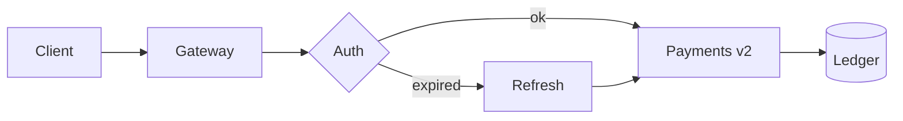

# Payments API — v2 rollout

The v2 gateway goes live in all regions on **August 12**. This page is the cutover plan.

> [!WARNING]
> v1 stops accepting new subscriptions on **August 5**. Migrate before then — existing
> subscriptions keep renewing through the end of the quarter.

## Request flow



## Rollout phases

| Phase  | Regions           | Traffic | Starts |
| ------ | ----------------- | ------- | ------ |
| Canary | `us-east`         | 5%      | Jul 29 |
| Ramp   | `us-*`, `eu-west` | 50%     | Aug 5  |
| GA     | all               | 100%    | Aug 12 |

## Pre-flight checks

- [x] Contract tests green against staging
- [x] Ledger backfill verified end-to-end
- [ ] Rate limits raised to 2k rps
- [ ] Runbook reviewed by on-call

## Verifying a region

```bash
curl -sS https://api.example.com/v2/health \
  -H "Authorization: Bearer $TOKEN" \
  | jq '{region, version, ledger_lag_ms}'
```
