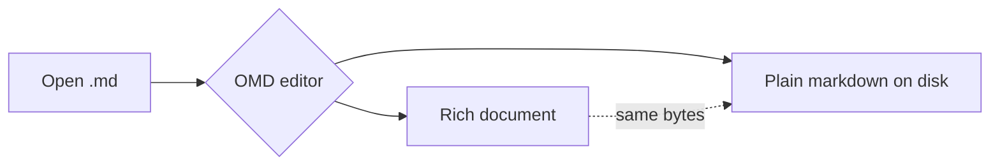

# GFM Fidelity

Everything on this page is **standard GitHub Flavored Markdown**. OMD renders it richly in the
editor, but the bytes on disk are exactly what GitHub would render — nothing here is OMD-specific.

<!-- omd:toc {"ordered":false,"maxLevel":"2"} -->

## Text

Regular, **bold**, _italic_, _**bold italic**_, ~~strikethrough~~, `inline code`, and a hard line break\
puts this text on the next line.

Sub/superscript and a few semantic inline tags round-trip as raw HTML GitHub allows:
H<sub>2</sub>O, E = mc<sup>2</sup>, press <kbd>Cmd</kbd>+<kbd>B</kbd>, and <mark>highlight</mark> a phrase.

## Emoji

GitHub renders `:shortcode:` emoji, and so does OMD — :tada: :rocket: :white_check_mark: :thumbsup:
:sparkles:. Type `:` for a searchable picker, or write the shortcode directly; OMD shows the glyph
in the editor while keeping the `:shortcode:` on disk, so the bytes stay portable (put a cursor on
one to edit the raw code). Emoji you don't recognize by name are still rendered by the preview and
HTML export.

## Lists

- Unordered item
  - Nested item
    - Deeper still
- Back to the top level

1. First
2. Second
   1. Second-A
   2. Second-B
3. Third

Task lists (checkboxes are clickable in OMD, and real GFM on disk):

- [x] Parse markdown into a rich document
- [x] Render every construct natively
- [ ] Write the perfect commit message

## Blockquotes & alerts

> A plain blockquote, which can contain **formatting**, `code`, and
> multiple lines.

GitHub renders these five alert types natively — so does OMD:

> [!NOTE]
> Useful information the reader should notice.

> [!TIP]
> A helpful suggestion.

> [!IMPORTANT]
> Key information the reader needs.

> [!WARNING]
> Something that needs immediate attention.

> [!CAUTION]
> Potential negative consequences.

## Tables

Column alignment is honored (left / center / right):

| Feature        | Status | Since |
| :------------- | :----: | ----: |
| Round-trip     |    ✅   |  v0.1 |
| Smart blocks   |    ✅   |  v0.4 |
| Table controls |    ✅   |  v0.7 |

## Code

Fenced code is syntax-highlighted (Shiki) in the editor and stays a plain fence on disk:

```ts
export function greet(name: string): string {
  return `Hello, ${name}!`;
}
```

```python
def fib(n: int) -> int:
    a, b = 0, 1
    for _ in range(n):
        a, b = b, a + b
    return a
```

## Links & autolinks

A normal [labeled link](https://github.com), a bare autolink <https://example.com>, and an
email autolink <hello@example.com>. Footnotes are auto-numbered.[^gfm]

## Math

GitHub renders LaTeX math, and so does OMD (KaTeX). Inline: the identity $e^{i\pi} + 1 = 0$.
Display:

$$
\int_{-\infty}^{\infty} e^{-x^2}\,dx = \sqrt{\pi}
$$

## Mermaid

GitHub renders ` ```mermaid ` fences natively; OMD renders them live as you edit:



---

[^gfm]: Footnotes are native GFM — defined once, auto-numbered wherever referenced.

_Next: [[Smart Blocks]] →_
