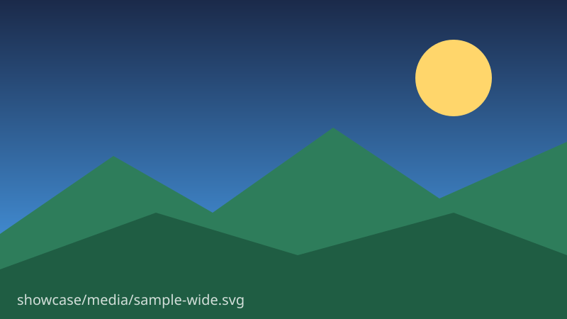

# Media

OMD gives images, video, and galleries a rich editing UX — resize handles, alignment, captions —
all stored in **GitHub-renderable coexistence forms**. Hover any image for its controls.

<!-- omd:toc {"ordered":false,"maxLevel":"2"} -->

## Local media linking

Media doesn't have to be remote. This image is a **local file** in this wiki, referenced with a
relative path (`media/sample-wide.svg`) — it travels with the repo and renders on GitHub:

## Sizing

A bare `` stays plain markdown. The moment you resize it, OMD writes a GitHub-honored
`` — still just an image to any reader:

## Captions

A caption wraps the image in a `<figure>` / `<figcaption>` (GitHub renders both):

<figure>
  
  <figcaption>A captioned figure — the caption is editable inline.</figcaption>
</figure>

## Alignment

Alignment reuses the `
` form GitHub understands. Here the image is centered:

## YouTube

The YouTube block renders a resizable, alignable, captionable thumbnail "player". On disk it keeps a
plain linked thumbnail so GitHub shows a clickable preview; `width`/`caption` live in the shortcode
and alignment in the `
` wrapper:

<!-- omd:youtube {"url":"https://youtu.be/dQw4w9WgXcQ","width":"480","caption":"A captioned, centered video"} -->

<!-- /omd:youtube -->

## Gallery

A responsive image grid. In OMD each thumbnail has a hover **remove** button and there's an **Add
image** control; on disk it's just a set of images GitHub lays out inline:

<!-- omd:gallery {"columns":"3"} -->

<!-- /omd:gallery -->

---

_Next: [[Tables]] →_
